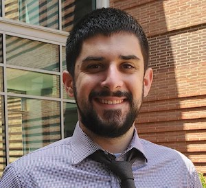

  
 

Hi there! My name is Nathan LaPierre, and I am currently a Postdoctoral Research Fellow in the Department of Medical Oncology at the Dana-Farber Cancer Institute and Harvard Medical School, working in the lab of Alexander Gusev.

I am a computational biologist and methods developer. My current research focuses on using deep generative models and single-cell data to make causal predictions of perturbation effects. In the past, I have worked on various problems in statistical genetics and genomics, including Mendelian randomization, fine mapping, deep learning for disease prediction, and metagenomics.

For more details, see the links below. 

Important links:

<a href="https://raw.githubusercontent.com/nlapier2/CV/master/CV.pdf">Curriculum Vitae (pdf)</a>
  |  <a href="https://scholar.google.com/citations?user=EVMceKUAAAAJ&hl=en">Google Scholar</a>
  |  <a href="https://github.com/nlapier2/">GitHub</a>
  |  <a href="https://www.twitter.com/nlapier2">Twitter</a>
  |  <a href="https://www.linkedin.com/in/nathan-lapierre-96665a98">LinkedIn</a>

