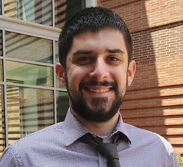

---
# Feel free to add content and custom Front Matter to this file.
# To modify the layout, see https://jekyllrb.com/docs/themes/#overriding-theme-defaults

layout: home
---

  

Hi there! My name is Nathan LaPierre, and I am currently pursuing a PhD in Computer Science at the University of California, Los Angeles (UCLA). My expected graduation date is June 2022.

My research interests lie in computational genetics, genomics, and metagenomics, where I am focused on developing algorithmic, statistical, and machine learning methods, including deep learning.

Important links:

<a href="https://raw.githubusercontent.com/nlapier2/CV/master/CV.pdf">Curriculum Vitae (pdf)</a>
  |  <a href="https://scholar.google.com/citations?user=EVMceKUAAAAJ&hl=en">Google Scholar</a>
  |  <a href="https://github.com/nlapier2/">GitHub</a>
  |  <a href="https://www.twitter.com/nlapier2">Twitter</a>
  |  <a href="https://www.linkedin.com/in/nathan-lapierre-96665a98">LinkedIn</a>

