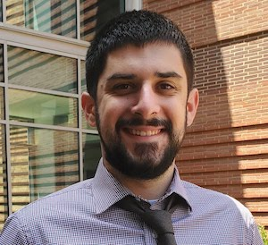

---
# Feel free to add content and custom Front Matter to this file.
# To modify the layout, see https://jekyllrb.com/docs/themes/#overriding-theme-defaults

layout: home
---

  

Welcome to my website! My name is Nathan LaPierre, and I am currently a Postdoctoral Research Fellow in the Department of Medical Oncology at the Dana-Farber Cancer Institute and Harvard Medical School, working in the lab of Alexander Gusev.

I am a computational biologist and machine learning researcher. 
My current work broadly focuses on "virtual cell" models, including tasks such as perturbation prediction and trajectory inference for single cell data. 
I develop machine learning methods towards these ends, and I am particularly interested in developing and applying deep generative models and foundation models. 
I am interested in applications of these models to cellular reprogramming and differentiation, as well as applications to aging, cancer, and other diseases. 
Broadly, my goal is to help bring about a future in which biology is much more quantitative and predictable, and thus amenable to control and optimization, leading to revolutionary progress in biomedicine and bioengineering. 

In the past, I have worked on various problems in statistical genetics and genomics, including Mendelian randomization, fine mapping, deep learning for disease prediction, and metagenomics. 
I completed a PhD in Computer Science at UCLA and worked as a postdoc at the University of Chicago.

For more details, see the links below. 

Important links:

<a href="https://github.com/nlapier2/CV/raw/master/CV.pdf">Curriculum Vitae (pdf)</a>
  |  <a href="https://scholar.google.com/citations?user=EVMceKUAAAAJ&hl=en">Google Scholar</a>
  |  <a href="https://github.com/nlapier2/">GitHub</a>
  |  <a href="https://www.twitter.com/nlapier2">Twitter</a>
  |  <a href="https://www.linkedin.com/in/nathan-lapierre-96665a98">LinkedIn</a>

